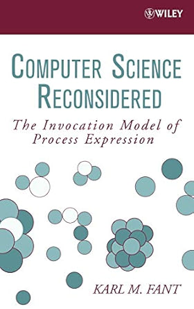

# Reality Compiler



**Reality Compiler (RC)** is a novel computing framework for compiling *invocation-based logic* into concrete, deployable hardware targets — from FPGAs to Vulkan-enabled GPUs.

This project challenges traditional assumptions about how software, computation, and logic are expressed — drawing inspiration from the book **_Computer Science Reconsidered_**, and building a fully custom toolchain for digital logic synthesis, program routing, and distributed evaluation.

---

## ✨ Key Features

- **Invocation-based computation model** — no stack, no registers, no sequential tape. Just named places and signal flow.
- **Conditional logic resolution** via match-based pattern execution (like I/O table lookup at the logic level).
- **FPGA and GPU targets** — programs can be compiled to Verilog/VHDL or SPIR-V assembly.
- **Signal graph rewiring and stabilization** — a nodal execution model driven by signal propagation.
- **Structured S-expression format** for definitions and invocations, making input/output traceable and parseable.
- **Unified backend for digital and parallel architectures** — potentially deployable across physical hardware, embedded systems, and compute clusters.

---

## 🛠 Current Capabilities

- Parses and compiles logic gate definitions (AND, OR, NOT, XOR, NOR) and conditional resolvers.
- Evaluates compiled blocks with traceable logs, pattern matching, and stabilization cycles.
- Outputs SPIR-V assembly (GPU) and has groundwork for VHDL/Verilog (FPGA) generation.
- Constructs a real-time signal wiring graph from input S-expressions.

## 📦 Project Structure

| Directory        | Description                                                                 |
|------------------|-----------------------------------------------------------------------------|
| `src/`           | Core C source code for the compiler and evaluator                          |
| `inv/`           | S-expression definitions for gates and invocation logic                    |
| `build/`         | Build output (compiled, SPIR-V, etc.)                                      |
| `build/out/`     | Final program output (SPIR-V binaries, unified s-expressions, VHDL, etc.)  |
| `external/`      | Static libraries (mkrand, sqlite, tinyosc, etc.)                           |

## 🛠 Build Instructions (Meson)

We use [Meson](https://mesonbuild.com/) as the primary build system and [Ninja](https://ninja-build.org/) as the backend.

## ✅ Prerequisites

Make sure you have the following installed:

```bash
# For macOS (Homebrew)
brew install meson ninja

# For Ubuntu/Debian
sudo apt install meson ninja-build

# 1. Set up the build directory
meson setup build

## 2. Compile the project
meson compile -C build
```

This builds rc and then runs it against the inv/ directory to generate the rewritten s-expressions with fully qualified signal names, which are the source of truth for the entire bult module which is the base for emitting to SPIRV and VHDL targets.